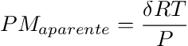

# Trabajo práctico 1: Uso de R
[TOC]

## Introducción

R es un conjunto integrado de programas para manipulación de datos, cálculo y gráficos. Entre otras características dispone de:

- almacenamiento y manipulación efectiva de datos,
- operadores para cálculo sobre variables indexadas (Arrays), en particular matrices, 
- una amplia, coherente e integrada colección de herramientas para análisis de datos, 
- posibilidades gráficas para análisis de datos, que funcionan directamente sobre pantalla o impresora, y
- un lenguaje de programación bien desarrollado, simple y efectivo, que incluye condicionales, ciclos, funciones recursivas y posibilidad de entradas y salidas. (Debe destacarse que muchas de las funciones suministradas con el sistema están escritas en el lenguaje R)

Para más información este es un buen lugar para comenzar:

https://cran.r-project.org/doc/contrib/R-intro-1.1.0-espanol.1.pdf

En nuestra asignatura nos centraremos en los siguientes aspectos:

- Instalación de R y RStudio
- Importación y carga de datos
- Visualización gráfica de datos
- Análisis de regresión lineal

## Instalando R y RStudio

Lo primero que debemos hacer es instalar la distribución **base** para nuestro sistema operativo. 

http://mirror.fcaglp.unlp.edu.ar/CRAN/

Luego de descargar el instalador lo instalamos dejando las opciones por default.

Accediendo al siguiente link, descargamos la versión gratuita de RStudio Desktop (Free)

https://rstudio.com/products/rstudio/download/

Lo instalamos siguiendo las opción por default. Si no se creo un acceso directo en el escritorio encontraremos el RSstudio apretando la tecla windows y tipeando RStudio.

## Instalando algunas librerías

Las "librerías", bibliotecas o libraries  son grupos de funciones que pueden agregarse a nuestro entorno de trabajo. Aportan funcionalidades que no están incluidas en el paquete base de R.

En vez de escribir un montón de código para hacer algo, instalamos una librería que tiene todo ese código ya escrito y llamamos a las funciones que están en esa librería con comandos específicos.

Para instalar una librería abrimos el rstudio y en la consola tipeamos:

```R
install.packages("nombre de la libreria")
```

Vamos a instalar los siguientes:

```
install.packages("tidyverse")
install.packages("ggpubr")

```

La operación anterior puede tardar un rato por lo que les recomendamos hacerla con anticipación.


## Nuestro primer script de R

Lo primero que vamos a hacer es crear un archivo (script) donde guardaremos todos los comandos que vayamos utilizando en conjunto con cualquier comentario que queramos agregar.

En RStudio vamos a File -> New File -> Rscript

Luego vamos a guardar este archivo (save as) en la misma carpeta donde tenemos los datos con los que vamos a trabajar. Para el caso del presente tutorial yo tengo mis archivos en una carpeta llamada "claseR" ubicada en el escritorio.

Nombraremos el archivo con su nombre para realizar la entrega del mismo más tarde. En este caso el archivo lo nombré como tp1-foni.R

Lo primero que debemos hacer es decirle a R el directorio donde vamos a trabajar.

```
setwd("D:/Home/Escritorio/claseR")
```

Esto mismo puede hacerse yendo a session -> set working directory -> to source file location.

Todos los comandos que escriban en la consola directamente se ejecutan pero no quedan guardados en el script, lo que queramos que quede guardado en el script hay que escribirlo en el panel superior. Para que se ejecute en la consola apretamos ctrl+enter.

Luego de establecer el directorio de trabajo vamos a cargar las librerías que vamos a utilizar:

```
library(ggplot2)
library(dplyr)
library(broom)
library(ggpubr)
```

## Importando un csv

Vamos a trabajar primero con el archivo datos1.csv. Recuerden que es más fácil por el momento que esté en la misma carpeta que el script.

Lo pueden descargar de aquí:

 [datos1.csv](datos/datos1.csv) 

Podemos abrir el archivo con el block de notas para ver su estructura. Veremos que las filas están separadas por enters y las columnas por comas.

R tiene una función dedicada a importar este tipo de archivos.

En RStudio vamos a File -> importa dataset -> from text (readr)

Con Browse elegimos datos1.csv y luego en el preview controlamos que esté todo bien.

Prestar atención al Code Preview en la esquina inferior derecha veremos algo como esto:

```
library(readr)
datos1 <- read_csv("datos1.csv")
View(datos1)
```

Como nos faltaba llamar a la librería "readr", RStudio lo hace por nosotros.

La segunda línea dice que guardemos el contenido del archivo csv en una variable que se llama datos1

La tercera línea le pide a R que nos muestre el contenido del objeto datos1.

Luego hacemos click en Import.

Deberíamos ver algo así:


Si hubiéramos querido, podríamos haber realizado la importación sólo escribiendo los códigos sin necesidad de utilizar la interfase gráfica.

Asegúrense de ir copiando todos los comandos en el script y que no queden sólo en la consola.

Cuando tenemos tablas muy grandes y queremos ver la estructura en la consola el comando head es muy útil porque nos muestra sólo el principio de la tabla.

Prueben escribir en el script

```
head(datos1)
```

Luego dar ctrl + enter

Tenemos ahora nuestros datos en R para hacer con ellos lo que queramos.

## Visualización de datos

Con el paquete básico de R podemos realizar algunos gráficos, el formato predefinido es un poco rústico por eso más adelante vamos a usar la librería ggplot2 porque con ella podemos hacer gráficos más bonitos más rápido.

Podríamos por ejemplo querer graficar el voltaje vs la temperatura

```
plot(datos1$`Diferencia de potencial/V` ~ datos1$`Temperatura/K`, data = datos1)
```

Mirar bien la sintaxis. El nombre de la función es plot. El argumento de la función tiene la forma y ~ x, data =datos.

El signo $ sirve para indicar a que variable nos queremos referir.

El gráfico que se obtiene es un tanto rústico pero suele ser útil para observar como se comporta nuestro conjunto de valores.

 Si queremos volver a llamar al gráfico anterior tenemos que guardarlo en un objeto.

Por ejemplo:

```
grafico1 <- plot(datos1$`Diferencia de potencial/V` ~ datos1$`Temperatura/K`, data = datos1)
```

Si no lo reemplazamos con otra cosa, cada vez que escribamos "grafico1" vamos a llamar al comando anterior.

Si reiniciamos R la memoria se borra y tendremos que ejecutar el script desde el comienzo nuevamente.

Nos puede interesar, si la tabla tiene muchas columnas por ejemplo, guardar las columnas por separado como objetos. Esto puede hacerse de la siguiente manera:

```
temperatura <- datos1$`Temperatura/K`
voltaje <- datos1$`Diferencia de potencial/V`
```

Lo que hicimos con los comandos anteriores fue guardar las columnas de la tabla en dos objetos (listas). Una lista se llama "temperatura" y la otra lista se llama "voltaje"

Probar ejecutar el siguiente comando:

```
temperatura
```

Y ahora este otro:

```
plot(voltaje ~ temperatura)
```

Verán que se obtiene el mismo gráfico que teníamos antes.

Si queremos volver a armar una tabla (data frame) con las listas anteriores:

```
termocupla <- data.frame(temperatura, voltaje)
```

Obtenemos así la misma tabla que teníamos al principio. Guarda que se perdieron los títulos de las columnas originales. Pero no pasa nada porque no estamos modificando los datos crudos, nuestro archivo csv está intacto y podemos consultarlo cuando queramos.

## Gráficos más bonitos: ggplot2

Vamos a realizar el mismo gráfico que antes pero ahora con la librería ggplot2.

```
grafico2<-ggplot(termocupla, aes(x=temperatua, y=voltaje))+
  geom_point(colour = "red", size = 5)
```

Para verlo

```
grafico2
```

Recordar siempre teclear ctrl + enter para correr el comando.

En el panel de la izquierda podemos exportarlo y guardarlo donde queramos.

Este gráfico ya está mucho más lindo, aunque todavía nos falta modificar un par de cosas.

En el comando anterior cambiando la opción en "colour" podemos cambiar el color de los puntos y en "size" el tamaño.

Por ejemplo:

```
grafico3<-ggplot(termocupla, aes(x=temperatua, y=voltaje))+
  geom_point(colour = "black", size = 3)
```

Los que nos falta hacer es poner el nombre de los ejes de manera adecuada con sus unidades y remover el fondo gris del gráfico. Esto último es opcional pero en la mayoría de las publicaciones científicas los gráficos van con fondo blanco.

Para hacer esto de manera rápido podemos hacer uso de los temas. Hay muchísimos temas ya creados para ggplot2, los pueden revisar acá:

https://ggplot2.tidyverse.org/reference/ggtheme.html

Nosotros vamos a usar el tema clásico. Para eso vamos a modificar nuestro gráfico anterior (grafico3)

```
grafico4 <- grafico2 +
  theme_classic() +
  labs(title = "",
       x = "Temperatura /K",
       y = "Voltaje /v") 
```

Y para verlo:

```
grafico4
```

Este gráfico ya es mucho más decente y pude ser utilizado en cualquier informe o publicación.

## Regresión lineal

A continuación vamos a ver como generar un modelo de regresión lineal sencillo y como podemos visualizarlo.

No vamos a entrar acá en los pormenores matemáticos acerca de los requisitos que se tienen que cumplir para poder hacer una regresión lineal.

Lo único que vamos a decir, es que lo que pretendemos hacer es explicar la relación entre 2 variables. La relación entre ambas NO siempre es lineal. Aunque parezca una pabada, sólo podemos hacer regresiones lineales cuando la relación entre las variables es "más o menos" lineal en el rango de datos que estamos trabajando.

Hay test estadísticos que podemos realizar, pero por ahora nos vamos a quedar con el gráfico que hicimos más arriba, si vemos que los puntos se distribuyen en algo parecido a una recta, tenemos el OK y podemos generar nuestro modelo.

En R usamos el comando lm (lienal model)

```
regresion1 <- lm(voltaje ~ temperatura, data = termocupla)
```

Podemos ver el resultado con summary

```
summary(regresion1)
```

En la consola aparecerá la info de siempre. La ordenada al origen (Intercept), la pendiente (en este caso temperatura), los valores de R y R cuadrado y mucha otra información que no analizaremos aquí.

Para graficar la recta de regresión, la agregamos al grafico4

```
grafico5 <- grafico4 + geom_smooth(method="lm",se=FALSE, col="red")
```

Si cambiamos a se=TRUE veremos un sombreado que indica la distribución del error (se: standard error).

Si quisiéramos presentar la ecuación de regresión en el gráfico podemos hacerlo con:

```
grafico6 <- grafico5 +
  stat_regline_equation(label.x = 310, label.y = 0.56)
```

Donde label.x y label.y son las coordenadas donde queremos que aparezca la ecuación en las unidades respectivas de los ejes.

**Exportar todos los gráficos que fueron generando y guardarlos para entregar junto con el script.**

## Parte II: usando el R para resolver un ejercicio de la guía.

Vamos a usar lo aprendido para resolver el ejercicio 1.6 de la guía de seminarios.

En ese ejercicio nos dan datos de densidad vs presión para un gas. En el siguiente archivo podemos encontrar los datos:

 [datos2.txt](datos/datos2.txt)

Vamos a ver como podemos usar el R incluso para hacer las cuentas.

Primero con papel y lápiz debemos encontrar la relación entre el peso molar (PM) y la presión (P):



Con esto podemos calcular los pesos moleculares aparentes para cada presión.

Importamos los datos como vimos en apartado anterior:

```
datos2 <- read_delim("datos2.txt", "\t", escape_double = FALSE, trim_ws = TRUE)
head(datos2)
```

(Cuidado que ahora los datos están separados por tab, indicar esto en las opciones de importación) 

Vamos a crear objetos con las variables para poder trabajar con ellas más fácil

```
atm <- datos2$`Presion(kPa)`*1000/101325
```

Notar que también incluimos la operación necesaria para pasar de kPa a atm.

Y para los valores de densidad:

```
densidad <- datos2$`Densidad (kg/m3)`
```

Notar que kg/m3 es lo mismo que g/l

Ahora calculamos los PM:

```
aparentes <- densidad*0.082*298/atm
```

Ahora "aparentes" es un objeto que contiene una lista de todos los pesos moleculares calculados.

Ahora juntamos los datos de presión y PM en un nuevo data frame:

```
pm.dataframe <- data.frame(aparentes, atm)
head(pm.dataframe)
```

Por último podemos graficar los PMaparentes vs la presión:

```
grafico7<-ggplot(pm.dataframe, aes(x=atm, y=aparentes))+
  geom_point(colour = "black", size = 3)+
  theme_classic() +
  labs(title = "",
       x = "Presion /atm",
       y = "PM aparente /g.mol-1") 
```

Si queremos sacar algún punto de la regresión este es un buen momento para eliminarlo de los datos.

Luego hacemos lm para obtener la ecuación de la recta y así sacar el mejor peso molecular de la ordenada al origen.

```
regresion2 <- lm(aparentes ~ atm, data = pm.dataframe)
summary(regresion2)
```

**Incluir con el archivos para entregar el script con los comandos de esta última parte, el gráfico y el resultado del summary del análisis de regresión.**
