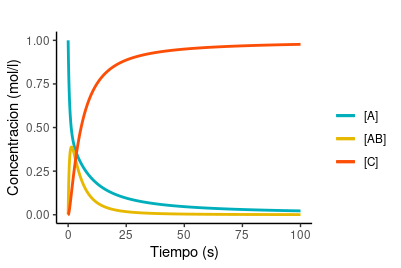

# [Ecuaciones diferenciales en R]()

En la siguiente sección vamos a ver como puede usarse el R para resolver de forma numérica, sistema de ecuaciones diferenciales.

Como caso de estudio vamos a analizar el siguiente mecanismo propuesto para una reacción de A con B que da C, doonde AB es el intermediario. 


Nos interesa poder calcular la concentración de todas las especies en función del tiempo. Los datos con los que contamos son el mecanismo, los valores de las constantes de velocidad y las concentraciones inciales de todas las especies.

Podemos escribir el sistema de ecuaciones diferenciales que describen la evolución temporal del sistema.


Debemos resolver el sistema anterior para encontrar los perfiles correspondientes a cada especie. Para ello utilizaremos el paquete **deSolve**. Este paquete no viene en la versión base de R y debemos instalarlo. 

En windows, necesitaremos instalar primero Rtools, lo pueden encontrar aquí:

https://cran.r-project.org/bin/windows/Rtools/

En linux puede ser que no tengan que instalar nada extra, si al instalar el paquete da algún código de error, leerlo para ver que librerías faltan. En mi caso tuve que instalar en el sistema **gfotran**, l**ibopenblas-base** y **libopenblas-dev**.

Si todo saliói bien podemos cargarlo con exito. También cargaremos ggplot2 para hacer algunos gráficos.

```
library(deSolve)
library(ggplot2)
```

El paquete deSolve permite resolver distintos tipos de ecuaciones diferenciales de forma numérica implementando distintos algoritmos.

Nos centraremos aquí en como usar el paquete, no en lo que hace el paquete para resolver el sistema de ecuaciones.

Para más información sobre este paquete pueden a 

https://journal.r-project.org/archive/2010/RJ-2010-013/RJ-2010-013.pdf

https://cran.r-project.org/web/views/DifferentialEquations.html

https://cran.r-project.org/web/packages/deSolve/vignettes/deSolve.pdf

No entraremos en más detalles aquí pero queremos resolver un sistema de ecuaciones diferenciales ordinarias con condiciones iniciales (Initial value problems (IVP) of ordinary differential equations (ODE)).

La forma de hacer esto en R es primero especificar el modelo y luego aplicarlo. Luego por supuesto graficaremos los resultados obtenidos.

## Especificación del modelo

La especificación del modelo consta de 3 partes.

- Definición de los parámetros y sus valores;
- Declaración de las variables y sus condiciones iniciales;
- Implementación de las ecuaciones del modelo.

En esta sección indicaremos al R cuales son nuestros parametros (las constantes de velocidad) y cuáles nuestras variables (el tiempo es nuestra variable independiente y la concenctración de todas las especies son nuestras variables dependientes). También indicaremos las condiciones iniciales. 

Por poner un ejemplo, tomarán los siguientes valores:

[A] = 1 M
[B] = 1 M
k1 = 1 M-1 s-1
k-1 = 0.3 s-1
k2 = 0.3 s-1

Primero especificaremos los valores de los parámetros

```
parameters <- c(k1 = 1, k2 = 0.3, k3 = 0.3)
```

Luego las variables junto con sus condiciones iniciales

```
state <- c(A = 1, B = 1, AB = 0, C = 0)
```

Luego escribiremos nuestro modelo basado en las ecuaciones diferenciales anteriores. Para  ellos tenemos que hacer algo que no hicimos previamente hasta ahora que es definir una nueva función.

```
Cinetica <- function(t, estado, parametros) {
  with(as.list(c(estado, parametros)), {
    dA <- -k1*A*B + k2*AB
    dB <- -k1*A*B + k2*AB
    dAB <- k1*A*B - k2*AB - k3*AB
    dC <- k3*AB
    return(list(c(dA, dB, dAB, dC)))
  })
}
```

Podemos discutir más adelante los pormenores del comando anterior, pero lo importante es que creamos una función (Cinetica) que depende del tiempo, nuestras variables y los parámetros. La manera en la que se vinculan estos objetos esta dada por nuestro sistema de ecuaciones diferenciales (notar que no hace falta escribir el dt)

Todas las funciones deben tener un return que es lo que nos devolverá luego de aplicarla. En este caso la función nos devuelve una lista con los valores de la tasa de cambio de cada variable.

## Aplicación del modelo

La aplicación del modelo consta de 3 partes.

- Definición del intervalo de tiempo que queremos integrar;
- Integración de las ecuación del modelo;
- Visualización de los resultados obtenidos.

Crearemos una lista con los valores de tiempo

```
tiempos <- seq(0, 100, by = 0.01)
```

En el comando anterior creamos una secuancia desde 0 hasta 100 yendo de 0.01 en 0.01.

Para la integración del modelo utilizaremos la función ode (que está dentro de deSolve).

```
salida <-  ode(y = estado, times = tiempos, func = Cinetica, parms = parametros)
head(salida)
```

Deberíamos ver algo cómo lo siguiente:

```
> head(salida)
     time         A         B          AB            C
[1,] 0.00 1.0000000 1.0000000 0.000000000 0.000000e+00
[2,] 0.01 0.9901134 0.9901134 0.009871744 1.483293e-05
[3,] 0.02 0.9804497 0.9804497 0.019491386 5.890677e-05
[4,] 0.03 0.9710021 0.9710021 0.028866457 1.314914e-04
[5,] 0.04 0.9617638 0.9617638 0.038004311 2.318669e-04
[6,] 0.05 0.9527283 0.9527283 0.046912387 3.592994e-04
```

El objeto salida contiene los perfiles de concentración de cada especie en función del tiempo. *OJO que este objeto NO es un data frame.*

Pero podemos convertilo en uno fácilmente

```
resultado <- data.frame(salida)
head(resultado)
```

Obtenemos lo siguiente

```
> head(resultado)
  time         A         B          AB            C
1 0.00 1.0000000 1.0000000 0.000000000 0.000000e+00
2 0.01 0.9901134 0.9901134 0.009871744 1.483293e-05
3 0.02 0.9804497 0.9804497 0.019491386 5.890677e-05
4 0.03 0.9710021 0.9710021 0.028866457 1.314914e-04
5 0.04 0.9617638 0.9617638 0.038004311 2.318669e-04
6 0.05 0.9527283 0.9527283 0.046912387 3.592994e-04
```

Todo lo que resta hacer es visualizar los datos obtenidos. Como en este caso especial los valores de [A] y [B] son idénticos, graficaremos sólo uno de los dos.

```
colores <- c("[A]" = "#00AFBB", "[AB]" = "#E7B800","[C]" = "#FC4E07")

plot <- ggplot(resultado, aes(x=time)) +
  geom_line(aes(y=A, colour = "[A]"), size = 1) +
  geom_line(aes(y=AB, colour = "[AB]"), size = 1) +
  geom_line(aes(y=C, colour = "[C]"), size = 1) +
  theme_classic() +
  labs(title = "",
       x = "Tiempo (s)",
       y = "Concentracion (mol/l)",
       colour="")+
  scale_color_manual(values = colores)
```

Podemos ver como quedó nuestro gráfico

```
plot
```


